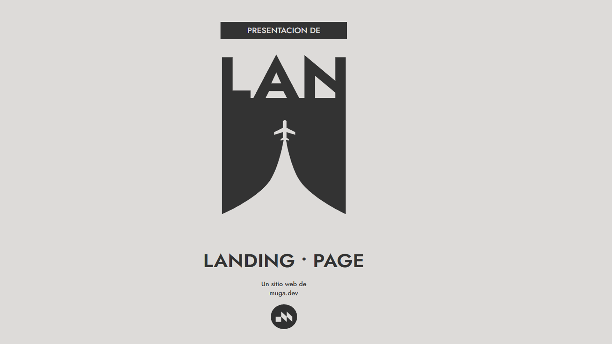

# muga-dev-landing-lite


**Estado:** 🟢 Activo

Variante liviana del producto `muga-dev-landing`.
Pensada para casos simples donde se necesita una landing rápida,
sin complejidad ni estructura extendida.

## Qué es
Una versión reducida del producto de landing de MUGA.dev.
Mantiene criterio visual y claridad, eliminando capas innecesarias.

## Para qué sirve
- Landings muy simples.
- Pruebas de concepto.
- Proyectos con bajo requerimiento de escalabilidad.

## Relación con otros productos
Este repo **no reemplaza** a `muga-dev-landing`.

- `muga-dev-landing` → producto completo y escalable.
- `muga-dev-landing-lite` → versión mínima, rápida y directa.

## Público objetivo
- Proyectos pequeños.
- Clientes con necesidades acotadas.
- Uso interno cuando la complejidad no se justifica.

## Stack
- Astro
- CSS
- HTML semántico

## Desarrollo local
```bash
npm install
npm run dev


